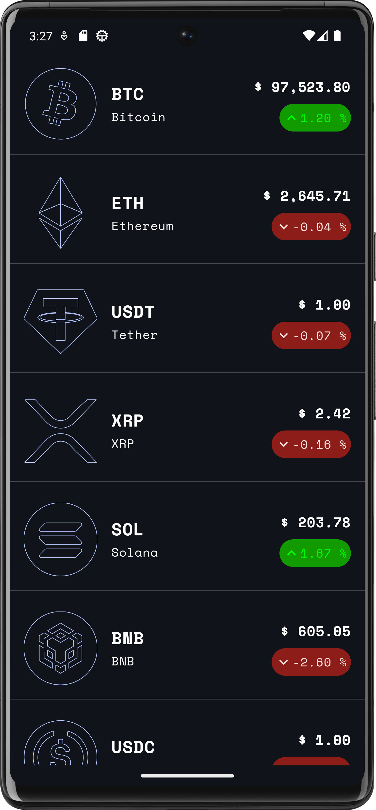
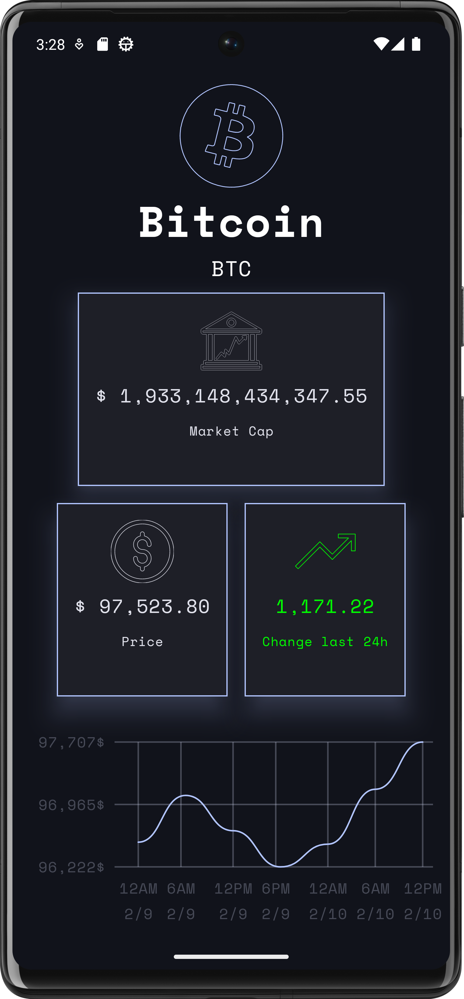
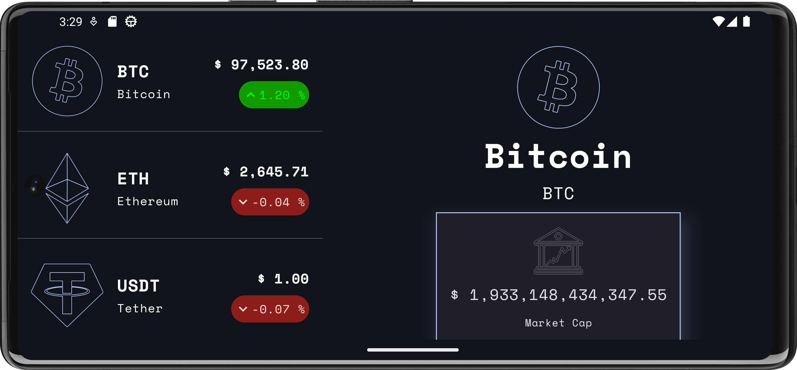
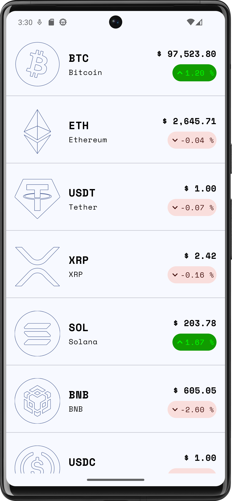
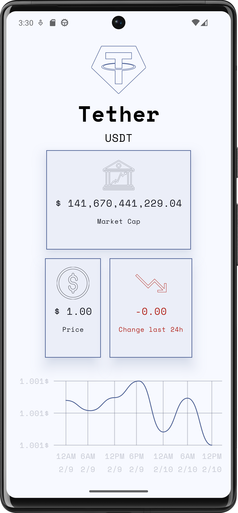
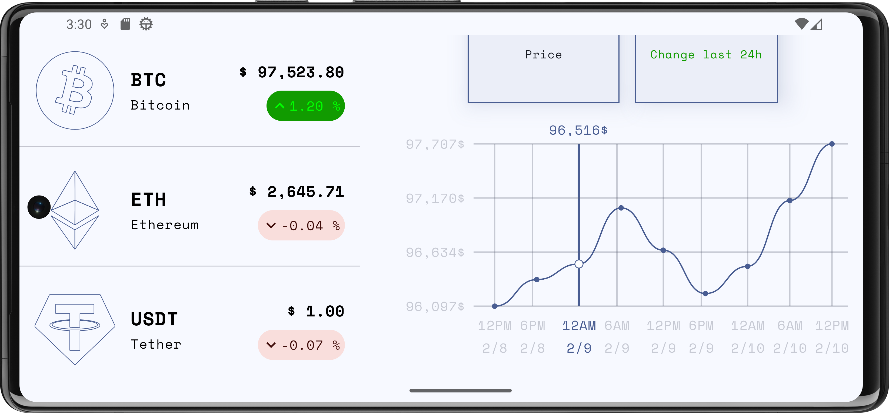

# CryptoTrackerApp

A real-time cryptocurrency tracker built with modern Android technologies.

## Features
- Real-time price tracking
- Interactive price history graphs
- Market stats and insights
- Dark/light theme support

## Demo Video
<iframe width="560" height="315" src="https://www.youtube.com/embed/DXGvq-6LeQY" title="YouTube video player" frameborder="0" allow="accelerometer; autoplay; clipboard-write; encrypted-media; gyroscope; picture-in-picture" allowfullscreen></iframe>

# Dark Mode

  
  
  

# Light Mode

  
  
  

## Tech Stack
- Jetpack Compose
- Material 3
- Kotlin Coroutines & Flow
- Ktor
- Koin
- Clean Architecture

## Setup
1. Clone the repository.
2. Open in Android Studio.
3. Build and run the app.
